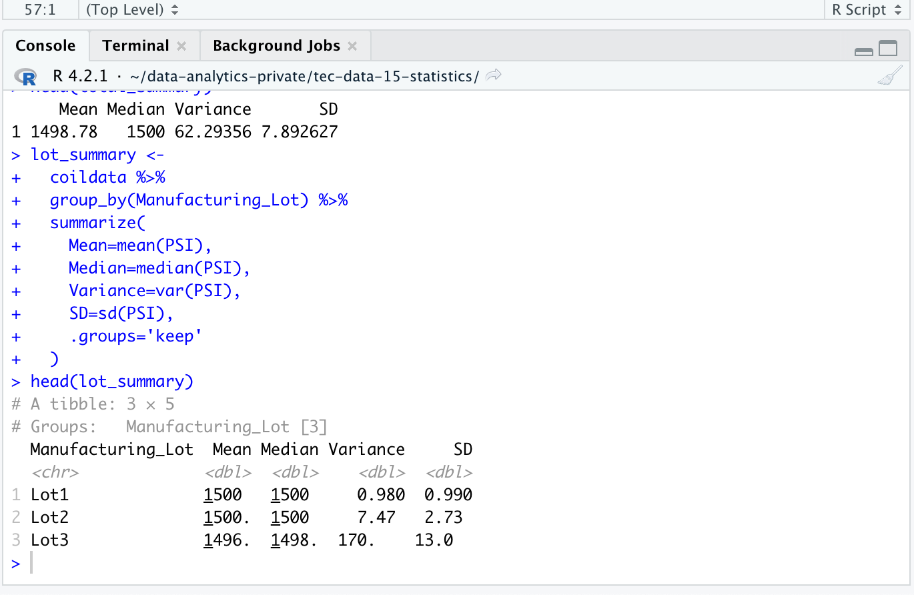

- [Statistical Analysis with R](#orgd26f736)
  - [Linear Regression to Predict MPG](#org9e1248c)
  - [Summary Statistics on Suspension Coils](#orgbc19066)
  - [T-Tests on Suspension Coils](#org2ddbbfa)
  - [Study Design: MechaCar vs Competition](#org53d8b47)

# Statistical Analysis with R

## Linear Regression to Predict MPG

The first linear regression gives us the following results.

When we call the summary we get our **p-value** and **multiple r-square**.

1.  The coefficients that provide a non-random amount of variance are: vehicle\_length and ground\_clearance (as well as the Intercept) because their **Pr(>|t|)** value is very small.
2.  The slope is not considered zero because the **r-squared** value is 0.7149, which means the relationship is linear. If we were to plot a line, it would be almost completely perpendicular to both axis.
3.  This model is effective on showing us which variables have the most impact (greater correlation) on the **Milles per Gallon** and which do not affect it as much, so now we can make decisions based on those predictions.

## Summary Statistics on Suspension Coils

These are both summaries on the suspension coils.

We can see that the total variance on the suspension coils is under 100 pounds per square inch, as per the design specifications. However, when we look at the lots **individually**, we can see that there is a problem with `Lot3`.

`Lot3` doesn&rsquo;t comply with the variance specification, as it&rsquo;s value is `170`, much higher than the required 100.

## T-Tests on Suspension Coils

The following tests are made to assert that the mean of each sample is apoximates the population mean. We can verify the measure in our summary table that we have already calculated.

If we compare the mean of the population against itself, we will get a **p-value** of `1` because the ratio is perfect.

However, when doing **one-sample-t-test** for each of the lots, we get a more revealing picture.

Lot1 T-Test

Lot2 T-Test

Lot3 T-Test

We can see that the **p-value** on `Lot1` and `Lot2` are within the confidence interval, but the value for `Lot3` which is equal to `0.1589` is not, which means this sample deviates from the mean of the population more than we would like it to be.

If our alternative hypothesis is the following:

> If we measure the mean of the Lot3, it should not deviate from the mean of the population considerably.

Then we can&rsquo;t validate it, so the null hypothesis would still stand.

> The mean of the Lot3 will deviate from the population mean considerably when measured.

## Study Design: MechaCar vs Competition

Using your knowledge of R, design a statistical study to compare performance of the MechaCar vehicles against performance of vehicles from other manufacturers.

Follow the instructions below to complete Deliverable 4.

1.  In your README, create a subheading ## Study Design: MechaCar vs Competition.
2.  Write a short description of a statistical study that can quantify how the MechaCar performs against the competition. In your study design, think critically about what metrics would be of interest to a consumer: for a few examples, cost, city or highway fuel efficiency, horse power, maintenance cost, or safety rating.
3.  In your description, address the following questions:

4.  What metric or metrics are you going to test?
5.  What is the null hypothesis or alternative hypothesis?
6.  What statistical test would you use to test the hypothesis? And why?
7.  What data is needed to run the statistical test?
